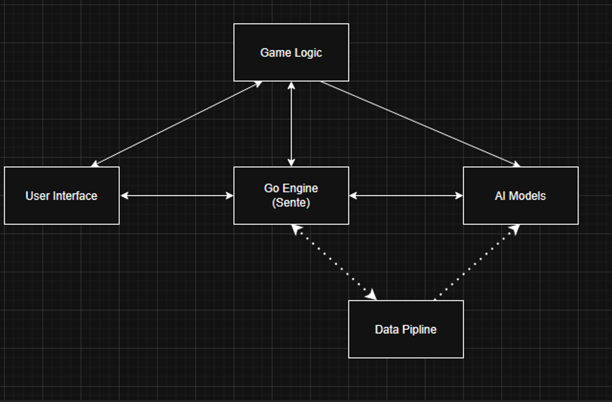
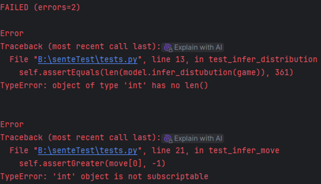
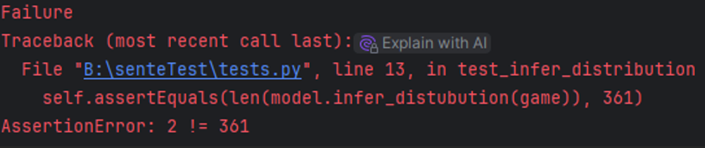
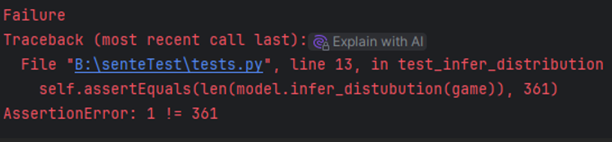

# Introduction
Our system was designed with the primary motivation of providing users with a human-like opponent for the Chinese game Go. Most Go-based software is designed to offer a virtual opponent optimized around winning matches.  We wanted to create a virtual set of opponents that would play more in a human-like style while still presenting some moderate challenge to the end user. The system creates a virtual Go game and presents an interactive UI for the user. The software offers the user the choice between three different AI models trained on three different skill levels of data. This creates a set of optional opponents at varying levels of difficulty. The software also utilizes the model trained on the highest tier of human data to serve as a move rating and recommendation system. These functions help the user to improve their skill with the game and make decisions in tough areas of strategy. Overall, the goal of the software is to help users improve skill in the game without presenting virtual opponents optimized for victory alone.
# Time Log
# Requirements
## Go Game Engine - complete
Our system presents a fully functional game of Go to the user using the Sente library as the primary engine to run the game of Go on the back end. Our system offers an interactive UI to allow human users to smoothly input moves and see model responses displayed on the game board.
## Neural Network AI - complete
Our software presents three convolutional neural networks which rrained on one million board states from their respective skill categories. The following data conveys the accuracy score each model achieved on a 10,000-board state test set which models were not trained on. The data effectively conveys how statistically human each model plays the game of Go.
| **Model Training data**| **Top-1 accuracy**| **Top-5 accuracy**| **Training data skill bracket**|
|----------------------------|---------------------|-------------------------------------------------|----|
| Hard Model| 25%|50% |8d |
| Intermediate Model|24% |45% |1k |
| Essay Model|21% |47% |18k |

The above data conveys that models are able to select which move a human would have played in 201 to 25 per cent of cases. If the model's top five moves are evaluated, it correctly guesses the human move in up to 50% of cases. Because there are 361 total board spaces the model can select from at any given point, the base rate for successfully picking a human-like move is 0.27%. Based on these figures our models perform almost two orders of magnitude superior to random guessing, even the weakest model is 78 times more likely to pick the correct move than random chance. What this means is that our models can successfully play statistically human moves in many states of the game. It should be noted that our method does not include search trees which consider future possible states of the game and as such our models will not perform as well as other techniques when it comes to global strategy. A consequence of that is that even our strongest model in terms of skill level could still be beaten by a competent user. What our models can do is play in a human fashion in local, moment-to-moment gameplay achieving our goal of constructing humanlike opponents even if they're not capable of posing a significant challenge to a skilled user.
## Move Quality Rater - complete
Our move quality rater queries the model trained on the highest skill level of human data, 8d, and creates a ranking of every possible move and how good the model believes them to be. The model's first choices are at the top of the list and by comparing the players’ chosen move to the model's chosen to move it creates an approximation of how good that move is based on the model’s reasoning. If the user's chosen move is in the top 20 moves selected by the model the move is rated as excellent if it is in the top 200 it is rated as mediocre if it is in the bottom 161 it is rated as a blunder.
## Move Recommendations - complete
The move recommendation system works in a similar manner to the move quality rater. The best model is shown in the current state of the board and asked to predict which move is the best. The move is shown to the users as a coordinate on the game board and they may freely choose if they wish to play the recommended move.

## Unfinished
The following are a list of wanted features which we did not start development on for this project.
-	Option to undo moves.
-	Option to Save the current game state.
-	Create a fine-tuned AI opponent using self-play.
-	Option to watch games between different AI models.
-	Option to add handicap cap stones.
-	Nine AI opponents three in the beginner, adept, and professional categories of increasing difficulty.
-	Options to pick board size from 7x7, 9x9, 13x13, and 19x19.
-	Game highlight review, which allows the user to review moves of great consequence to the game’s outcome.
-	Players’ game statistics such as average move quality, average time spent thinking per move and total number of mistakes.
# Design and Overall Structure
Our system uses Three main frameworks spread over five individual components to achieve the system core functionality. Below can be seen a diagram which describes the relationships between our core components. The arrow represents which components talk to which other components. Dashed connections represent relationships not used during normal play but were used during model training.


Our code structure is mainly organized around five main components
-	Main Game Logic System
-	Go Engine
-	User Interface
-	AI models
-	Data Pipeline
## General Design
Our Code is structured around the Main Game Logic System which is responsible for creating and maintaining a game of Go between a human and our AI models. The Game Logic system will manage all other major components in order to facilitate a functional game of Go. This component will create a game of Go using Sente and call the human user and AI models to make moves at the correct time. The component is also responsible for calling the system's UI to visually display the game to the user and offer menu functionality. The User Interface, Go Engine, and AI models work together to create a competitive game of Go. The User Interface and AI models both talk to the Go Engine so both entities can play moves and update the board state. The Data Pipeline, while not used during a normal game, is used in tandem with the Go Engine to create training data for the AI models component. Each comment when put together creates a fully functional game of Go complete with virtual opponents.
Our project uses three main frameworks to achieve core functionality Pytorch, Sente, NumPy, and Tkinker. 
-	Pytorch is used to create and train AI models
-	Sente serves as the system Go engine running and managing the game
-	NumPy creates data frames for AI training.
-	Tkinker is used to create a User Interface
## Desing Pattern
The Data Pipeline component employes and iterator design pattern to loop over every file in a directory for the purpose of converting those files to training data.
# Implementation
The following is description of key components frameworks, and other systems are implemented.
## Sente and the GO Engine
Sente is a python library that allows for managing and running a game of Go in the python program. In our structure Sente serves as a go between the user and AI models. Sente internally stores the current state of the board which can be displayed to either the user or AI models. Once the user or AI model has played their move Sente updates its internal board state which permits both entities to play a competitive game. Sente is also used to police interactions between the user and AI models ensuring all played moves are legal and identifying the winner at the end of the game. Sente’s convert to numpy function is also used to generate training data for the systems AI models.
## The Data Pipeline
The Data Pipeline component is not used during standard user software interaction but does serve the critical role of generating training data for the AI models used in the main system. The Data Pipeline is tasked with modernizing our old SGF files to be compatible with Sente, Converting SGF files to numpy arrays for training purposes, and training convolutional neural networks on the data. The pipeline loops over each SGF file and converts each board state into X data, and the human moves into y data.

The X data takes the shape (Nx19x19x4) where:
N, is the number of converted boards in the data frame
19x19, is the shape of a single Go board
4, is the number of channels the model will see (White Stones, Black Stones, Empty Intersections, Ko Points)
These channels are create by Sente’s numpy conversion which is why they are chosen for our purposes.

The y data is a one-dimensional array of integers between 0-360 which encodes for all possible moves a human may take.

All the X and y data pairs from all converted games are collected into master arrays which are saved to the disk for training purposes.
## Pytorch and Model Structure
Pytorch is the machine learning library used to create and run models in this project. Pytorch was used to create and train residual convolutional neural networks. Our models take as input a 19x19x4 array which encodes the current state of the board as has been previously discussed. The hidden layer of models is a 20-layer Residual Network (ResNet) at 128 channels. Because Go is a very shape and structure-based game, a ResNet architecture is ideal for picking up and recognizing complex and abstract features of the board. Because we are using a rather large deep learning network ResNet has the additional advantage of mitigating the degradation problem often suffered by deep networks. The output layer of the models is a linear network which maps to 361 coordinates to represent where the model predicts a human would play a stone.
## NumPy
NumPy is used to create and save training data using memmap arrays. Memmap are functionally similar to a standard numpy array with the exception of allowing memory streaming from the disk. Numpy’s memmap arrays enable revival of training data files which may exceed the system's available ram by streaming the array data directly from the disk during model training. This ensures that training data is accessible even if the raw files are larger than our computers can handle.
Tkinter and the User Interface
The user interface is the primary component the user interacts with. The system manages user moves and allows for the selection of options like move recommendation or model diffaculty. The system interacts with Sente and the Main Game Logic system primarily to help facilitate a functional game of Go. The UI elements themselves are created using the Tkinter library which features built-in support for window creation, menu options, and user input.
## The Model Component
The Model Component acts as a virtual adversary for the end user. The system primarily interacts with Sente and the Main Game Logic System. The component is primarily responsible for making moves to oppose the user along with rating and recommending moves to the user. One of the primary functions of this component is to convert the models’ default tensor output into playable moves. This is done by ordering the tensors by highest to lowest value and pulling their corresponding board locations between 0-360. This rank order of moves can be converted to standard x, y coordinates on the board which allows the models to play a move or rate/recommend moves to the user.
## Main Game Logic
The Main Game Logic system interacts with all the components described above. Its primary job is to facilitate smooth interactions between all the core system components. It is responsible for handling user selected options along with instructing Sente to set up and restart games appropriately. Additionally, this system handles user AI interaction by passing user moves into Sente and calling AI models to generate opposing moves or recommend and rate moves. Essentially this system serves as a glue for all other program components (barring the Data Pipeline).
## Training Data
The training data for our models came from a publicly available Go data set on GitHub. This repository was chosen because it hosts human games broken down into different skill levels and stored in smart game format (SGF) files. These files store every move played for a given game of Go and can be read and converted into numpy arrays by Sente. In order to train three different models at three different skill levels we chose the directories in the 18K, 11K, and 8d skill brackets.
The breakdown of the skill levels is as follows:

| **Model Difficulty**|**Skill Rank**|**description of skill level**|
|---------------------|---------------|------------------------|
|Essay model|18k|This rank is often given to beginners who are just starting|
|Intermediate Model|1k|This rank is achieved by skilled beginners|
|Hard Model 8d|8d|This rank is just before professional level and only achieved after years of experience|

Unfortunately, the public repository we used did not have enough games at the professional level to serve as sufficient training data, so we used next best rank ‘dan’ as a replacement. Altogether our models trained on approximately 5000 games in their respective categories.
# exemplary pieces of code
# Jonah Benton - convertSGFtoNumpy.py
The section of code convertSGFtoNumpy.py is the primary element of the Data Pipeline and is responsible for converting raw SGF files to numpy data frames which can serve as X and y data for model training. Because our models attempt to predict what a human would play for a given board state the X data represents the state of the board and the y data represents the move a real human played on that state. 

The following function in convertSGFtoNumpy.py is responsible for converting an entire SGF file into X data.

```python
def convert_move_to_numpy(game):
    game.advance_to_root()
    sequence = game.get_default_sequence()
    all_moves = np.zeros((len(sequence)),dtype=np.uint16)

    for i in range(len(sequence)):
        x = sequence[i].get_x()
        y = sequence[i].get_y()
        game.play(sequence[i])
        all_moves[i]=(y*19)+x

    return all_moves
```
The game object passed into this function is used to represent and store an entire game of Go from an SGF file; how this object is created will be discussed later. 
```python
game.advance_to_root()
sequence = game.get_default_sequence()
```
The first line ensures that the game is ‘advanced to root’ that it is in the state of an empty board with no moves played. The sequence object stores the list of all moves played in the game object. 
```python
all_board_states = np.zeros((len(sequence), 19, 19, 4), dtype=np.uint8)
all_board_states[0, :, :,2]=1 # Fills the first frame with the values found in an empty board
```
The all_board_states variable will be used to store every converted board state for each game. The length of the array is set to the length of sequence or the total number of moves played in the game. The following 19x19x4 parameters represent a single board state where 19 by 19 is the dimension of a standard Go board and four represent each channel that will be presented to the model during training. The channels represent white stones, black stones, empty points and ko points. The following line sets the second index of the array's first position to all ones which represents an empty board. If this is not done the first index will erroneously store board with the first move all ready played rather than an empty board.
```python
for i in range(len(sequence)-1):
    game.play(sequence[i])
    board = game.numpy()

    if game.get_active_player() == stone.WHITE: # Flips white and black stones if its white's turn
        board = np.stack([board[..., 1], board[..., 0], board[..., 2], board[..., 3]], axis=2)

    all_board_states[i+1] = board # Adds board array to i+1 because the first index is an empty board
```
This loop progressively updates the game object with the next move from the sequence object; this has the effect of iterating over every move played in the game. After a move is played the board variable is used to store the numpy equivalent of the board state. The board is converted to a numpy array using Sente’s built-in ‘numpy()’ function. The board variable is passed into the next index of the all_board_states variable which effectively compiles every individual numpy array into one master array which stores every board state for an entire game. Some things to note here are that the loop only iterates for the length of the sequence minus one; this is because the final board state has no accompanying move as it is the last state of the game. All individual boards are passed into all_board_states[i+1] as the first index of that array is reserved to store an empty board.
```python
if game.get_active_player() == stone.WHITE: # Flips white and black stones if its white's turn
    board = np.stack([board[..., 1], board[..., 0], board[..., 2], board[..., 3]], axis=2)
```
This if statement essentially flips the position of the white and black stones whenever it is White's turn. Only the first two channels are flipped because Go is symmetric across color, so the other channels need not be changed. The reason this is done is to essentially trick the model into always believing it is playing as black. Doing this removes the need to add a color input to the data frame.

The following functions are responsible for converting individual human moves into a numpy array; it functions in a similar manner to the above function which converts entire board states.
```python
def convert_move_to_numpy(game):
    game.advance_to_root()
    sequence = game.get_default_sequence()
    all_moves = np.zeros((len(sequence)),dtype=np.uint16)

    for i in range(len(sequence)):
        x = sequence[i].get_x()
        y = sequence[i].get_y()
        game.play(sequence[i])
        all_moves[i]=(y*19)+x

    return all_moves
```
This code is used to iterate over every move played in a given Go from an SGF file and convert them into target data.
```python
game.advance_to_root()
sequence = game.get_default_sequence()
all_moves = np.zeros((len(sequence)),dtype=np.uint16)
```
This code sets the game to root and creates the sequence object along with creating a numpy array all_moves which is a one-dimensional array equal to the length of the sequence used to store y data.
```python
for i in range(len(sequence)):
    x = sequence[i].get_x()
    y = sequence[i].get_y()
    game.play(sequence[i])
    all_moves[i]=(y*19)+x
```
This loop iterates over every single move played in the game and converts each move into a number ranging from 0 – 360 (resenting all possible 361 moves). The first two lines in the loop find the x and y coordinates of the human made move which both scale from 0 to 18. The next line iterates the game object to the following move. The last line passes in the human move into the all_moves array by multiplying y by 19 and adding x creating a number from 0 - 360.

The last major function convert_all_games() loops over every single SGF file in a directory and converts the contents of each game into a master collection of data frames representing the entire directory including all games. The first major section of this function can be seen below:
```python
def convert_all_games():

    x_file = rf'{training_data_path}\X_file.npy'
    y_file = rf'{training_data_path}\y_file.npy'

    x = np.zeros((num_frames, 19, 19, 4), dtype=np.uint8)
    x.tofile(x_file)

    y = np.zeros((num_frames,), dtype=np.uint16)
    y.tofile(y_file)

    x = np.memmap(x_file, dtype=np.uint8, mode='r+', shape=(num_frames, 19, 19, 4))
    y = np.memmap(y_file, dtype=np.uint16, mode='r+', shape=(num_frames,))

    total_errors=0
    total_frames=0
```
The purpose of the above code is to establish the file locations where the master collection will be stored, create the arrays to store the data in, and establish variables to track progress and number of errors.
```python
x_file = rf'{training_data_path}\X_file.npy'
y_file = rf'{training_data_path}\y_file.npy'
```
These two variables represent the file location in which the training data will be stored. The training_data_path variable holds the location internal to the projects directory where data should be held.
```python
x = np.zeros((num_frames, 19, 19, 4), dtype=np.uint8)
x.tofile(x_file)

y = np.zeros((num_frames,), dtype=np.uint16)
y.tofile(y_file)
```
This code is responsible for creating memory maped numpy arrays to store the converted training data. The num_frames variable is used to control the total number of board states/moves which need to be converted into data frames. X and y possess the same shape as has been described above with the exception that they are far longer in length to accompany more frames than are found in a single game. By default, x and y will be over one million indices in length to store approximately 5000 converted games. The function tofile() saves the arrays to the disk.
```python
x = np.memmap(x_file, dtype=np.uint8, mode='r+', shape=(num_frames, 19, 19, 4))
y = np.memmap(y_file, dtype=np.uint16, mode='r+', shape=(num_frames,))
```
Here x and y are redefined into memmep arrays which are capable of holding more data than can fit in system RAM. This is done to ensure that training data is accessible even if the file size is larger than system memory allows.

Not every game in our data set is consistent with Sente’s internal rules and as a result will throw an error when attempting to convert into a numpy array. The total_errors variable is used to track the total number of such errors so that data loss can be measured. The total_frames variable is used to track the total amount of board states/moves that have been converted as the function iterates over the directory. 
```python
for index, file_path in enumerate(SGF_directory_path.iterdir()):
    # Loads one game from the SGF directory
    try:
        game = sgf.load(str(file_path), ignore_illegal_properties=True, fix_file_format=True, disable_warnings=True)
        sequence = game.get_default_sequence()
        current_frames = len(sequence)
    except sente.exceptions.InvalidSGFException:
        total_errors += 1
        continue

    try: # Fills the Training data frames with the converted data
        x[total_frames:total_frames+current_frames] = convert_board_state_to_numpy(game)
        y[total_frames:total_frames+current_frames] = convert_move_to_numpy(game)
        total_frames += current_frames

    # Some games are not compatible with sente's rule so this track to number of games which cannot be converted
    except sente.exceptions.IllegalMoveException:
        total_errors+=1
```
Above is the main loop which systematically iterates over every SGF file in the directory and converts the individual games within to data frames.
```python
game = sgf.load(str(file_path), ignore_illegal_properties=True, fix_file_format=True, disable_warnings=True)
sequence = game.get_default_sequence()
current_frames = len(sequence)
```
This code converts an SGF file into a game object and stores the length of the game and the current frames variable. It is encapsulated in an exception statement because some SGF files break Sente’s internal rules and as a result cannot be converted.
```python
x[total_frames:total_frames+current_frames] = convert_board_state_to_numpy(game)
y[total_frames:total_frames+current_frames] = convert_move_to_numpy(game)
total_frames += current_frames
```
This code converts the current SGF file into its associated numpy data frames as has already been described. The critical difference here is that those data frames are then passed into the master collections of x and y. The correct indices of x and y to pass in the freshly converted data frames can be found by traversing from the total number of already converted frames to the length of the data frames which are being passed in. Finally, this code updates total frames with the number of frames just processed and collected. The code is encapsulated in an exception statement to catch any instances of games which do not match Sente’s rules and prevent the entire system from crashing.
```python
if index%100==0: # Prints progress updates to the console
    print(f'Converted {index} games')

if total_frames>num_frames-1000: # Stops loop before the array size limit is reached
    print(f'Total Errors {total_errors}\nTotal Frames {total_frames}')
    x.flush()
    y.flush()
    break
```
This code is tasked with periodically printing updates to the console and ending the loop when the target number of board states/moves are converted. The code will print a simple update every 100 converted games. The final statement is responsible for ending the loop once all necessary conversions are complete. It does this by checking if the total number of converted frames is greater than the number of desired frames minus a buffer window of 1000 frames. Because games of Go are not deterministic it's impossible to know how many frames will be converted per game so here a buffer of 1000 frames are used to ensure that the memory limitations of the numpy arrays are never exceeded as it's virtually impossible for game of Go to exceed 1000 moves. The final lines of code are the flush function which commits the changes to the x and y memmap arrays to the disk.

All put together this code can convert an arbitrary number of SGF files into usable numpy data frames for model training and evaluation.
### Test Procedures
Because our AI systems are not deterministic most of our tests revolve around ensuring that the model is producing correctly structured data. This involves things such as ensuring the model is inferring correct rankings of all possible moves, that the code is selecting only legal moves, and labeling user moves appropriately. Following a series of test protocols designed to achieve these aims.
# Model Inference
Because the model needs to output a ranking of moves across the entire board space of 361 possible moves a test can be designed to ensure the model output is appropriately structured. This test protocol ensures that the output distribution of the model is a list of integers 361 indexes in length.
# Move Legality
Because our models are tasked with playing a game of Go, their output needs to consist of moves on a 19 by 19 grid and be legal relative to the current board state. This means that the model's output of rank moves in the form of a single integers. must be converted into a two-dimensional coordinate. This test procedure ensures that the two-dimensional coordinate output by the code is within the confines of a standard game of Go in legal as per the rules.
# Move Ranking
Our system is tasked with offering move ratings to the user upon request. This involves predicting a best to worse ranking of all moves across the entire board space. And finding the user’s move in that list. Our system tests this functionality by submitting a mock distribution with known rankings for individual move coordinates. If the code correctly labels individual coordinates with the correct ranking this validates the underlying ranking logic.
Along with finding the ordinal ranking of the user's move the system must also correctly label it as either excellent mediocre or a blunder. This can be done by creating a mock distribution of numbers 1 to 361 randomly shuffled in a deterministic fashion to mimic a distribution created by the models. Because the distribution is deterministic, certain coordinate locations of moves have predefined labels which can then be tested. If the code correctly returns the correct labels for the correct move coordinates, then it is working appropriately.
# Manual Play Testing
The final test our AI model undergoes is a play test to catch problems with move selection, rating, or recommendation which cannot be caught by automated tests. This manual test looks for problems like illogical moves, nonsensical ratings, or non alignment between recommendations and move quality rating. This testing helps to eliminate problems with non-deterministic code which automated tests cannot identify.
# Test Driven Development
The purpose of this test was to ensure that the inference function produced a list of 361 distinct integers which serve as a ranking of each possible move. Should the function fail to return a list of integers of the appropriate properties the test will fail.

Failing test:



This test failed because the function returned an integer object rather than an array of distinct integers. The function incorrectly returned an editor object in an attempt to convert the model output into an integer array. Code was refactored to return the entire data object without casting to an integer.


Second Failure:



The test failed because the function returned an array of two data objects, the output tensor and a list of integers which encodes the board locations from highest to lowest quality. The code was refactored to return the second object.

Third Failure:



This test failed because the array of integers that needed to be outputted was wrapped in another object array which caused its length to be interpreted as one rather than 361. Code was refactored to incorporate a numpy conversion which unwrapped the object and successfully returned the array of 361 integers passing the test.

## References
During development we used ChatGPT and Google Gemini mainly as knowledge tools to help with using frameworks like NumPy, Sente, and Pytorch. Due to unfamiliarity with Pytorch Gemini was used to generate code which creates and evaluates AI models although the code was altered for our purposes. A copy of all AI generated code can be found in the AI_Generated.py file or it can be found documented in the project code itself.

The medium article Understanding ResNet Architecture: A Deep Dive into Residual Neural Network by Azeem – 1 was used to help understand and explain ResNet Architecture.

Azeem - 1. (2023, November 14). Understanding resnet architecture: A deep dive into residual neural network | by Azeem - I | Medium. https://medium.com/@ibtedaazeem/understanding-resnet-architecture-a-deep-dive-into-residual-neural-network-2c792e6537a9


